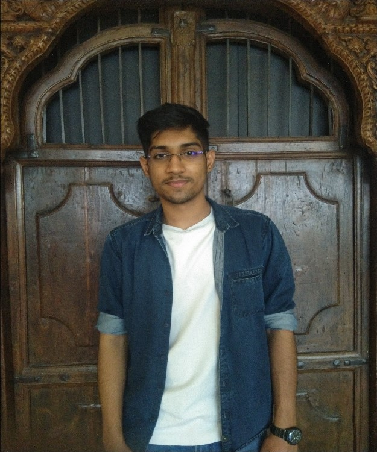
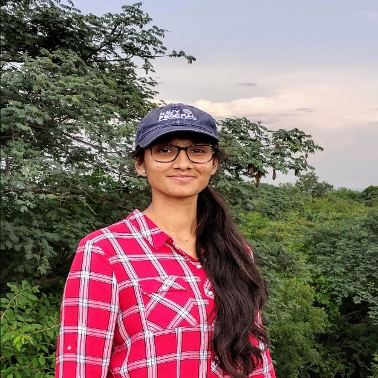

# Diagnostico

## Table of Contents
1. Introduction
2. Inspiration behind the product
3. Solution
4.  Major Challenge and how we over came it
5.  Future Plans
6.   Website
7.   Team

### 1. Introduction

Using simple Machine Learning , Statistical Modelling we plan to make diagnosis smoother and faster for both patients and medical personnel. 

### 2. Inspiration behind the product

In early 2020 when the first wave of COVID-19 hit the place where I live (Hyderabad) medical students and nurses were put on the front line. In government hospitals there is a lack of medical personnel, so, to attend to the extreme large volume of incoming patients medical students were being used to monitor and administer medicines to the patients. These people were not given proper protective measures and were getting exposed to an unknown virus at that time.  Many of my friends studying medicine were there in the front line and listening to their story inspired me to come up with a method to diagnose and monitor the patients remotely and from the past one year I have been working on similar lines to help them.
 
### 3. Solution

Our solution finds its application on two major fronts. One is the hospital front where we designed a low power , low cost , sterializable IOT based wearable device that would collect elementary body parameters like temperature, heart rate, SPO2(an indicator of COVID-19) & ECG data. This data is then pushed to a cloud platform where this data would be stored for future use. When the doctor wants to know the condition of  a patient then he simply has to enter the patient ID and the entire patient data would be available for him to monitor. Also, we have designed a serum cholesterol predictor that uses Machine Learning to determine the cholesterol levels instead of traditional painful invasive methods that rely on collecting blood samples. 

Also, a recent addition to our hospital end software is a CT , X-ray classifier that can classify the scans based on the body part and categorize them into folders. When a scan enters the model it uses Convolutional Neural Networks to classify them into chest, breast, head & abdomen and categorizes them. This helps in automation of classifying the scans by removing the need of the medical personnel physically doing this task. As many of the CT and X-ray machines have NVIDIA based GPUs integrated in them, using the NVIDIA-ClaraSDK would help us integrate our solution directly with the existing hardware removing the need for new hardware. 

The second front where our product finds its application is with the common man. We would make a version of this available for the public where the user would be able to find out his or her serum cholesterol and other elementary body parameters using this device. Also, as this has an integrated ECG this device would also help in monitoring cardiac abnormalities which are very common these days. 

### 4. Major Challenge and how we over came it

The major challenge we faced was improving the performance of the Convolutional Neural Network. Initially we tried transfer learning but the model was not reaching our target accuracy of > 97%. So, we decided to write our own network and we were not able to reach our target accuracy as the data had white noise in it and some of the images had some rotation. 

 We did some research on data augmentation methods and techniques like mean image subtraction. After implementing them , opting for an architecture without pooling layers and changing our activation function we saw significant improvement in our model. After a lot of fine tuning we hit an accuracy of 98.21% and reached our target.
 
### 5. Future Plans

The current version of our product was built and tested on Intel Dev Cloud but we plan to migrate our solution to the Google Cloud Platform. This would help us scale up much better.  Due to the COVID-19 lockdown and the increased taxes in Indian customs we were not able to get our hardware designs fabricated and have a raw prototype. In the very near future we plan on fabricating our PCB designs and testing our hardware. 

Also, we are testing the possibility of replacing the Convolutional Neural Network in our solution with a Capsule Network as we think it is better suited for our application.We are also moving to a tensorflow based implementation instead of our current PyTorch based models as it becomes much easy to deploy the models on edge and android devices.  Two members of our team are currently studying the model’s performance on the NVIDIA GPU vs the Google’s TPU and based on this result in the near future we would finalize an accelerator for our application. Apart from this we are currently designing a solution to run the model locally instead of a cloud platform to reduce recurring costs and are evaluating google corel for the same. 

### 6. Website

https://prakarsha01.github.io/  

### 7. Team

#### 1. Srimanth Tenneti
 
LinkedIn: https://www.linkedin.com/in/srimanth-tenneti-662b7117b/  
Email Id: srimanthtenneti@gmail.com 
Roles: 
1) Machine Learning and Deep Learning Core designer
2) Embedded hardware designer

#### 2. Cherukupally Krithika Reddy
 
LinkedIn: https://www.linkedin.com/in/krithika-reddy-8892461ba/ 
Email Id: krithikareddy001@gmail.com 
Roles:
1. Web Developer
2. Product Designer

#### 3. Kalimera Shashi Varun 
 
LinkedIn: https://www.linkedin.com/in/shashi-varun-90a836203/ 
Email Id: shashi.varun435@gmail.com 
Roles:
1. Product designer
2. Embedded driver developer

#### 4. Kandukuri Ratna Prakarsha
 
LinkedIn: https://www.linkedin.com/in/ratna-prakarsha-kandukuri-ba7b301a5/ 
Email Id: prakarsha2000@gmail.com 
Roles:
1. User experience designer
2. Web developer

